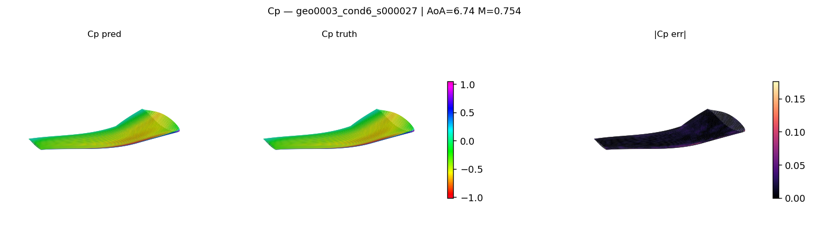
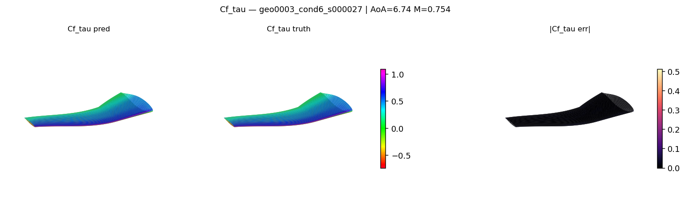
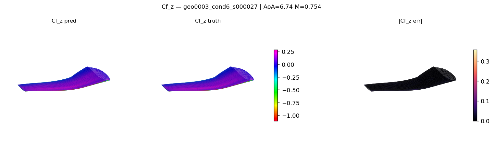
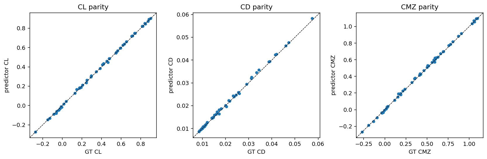

<!-- markdownlint-disable MD013 MD033 -->

# AeroJEPA — Tutorial Recipe

This example trains and evaluates the
[AeroJEPA](https://arxiv.org/abs/2605.05586) (Giral et al.) model on the **SuperWing**
3D aerodynamic dataset.

AeroJEPA is a Joint-Embedding Predictive Architecture: instead of mapping
geometry directly to a flow field, it predicts a *latent representation*
of the flow from a latent representation of the geometry and operating
conditions, and reconstructs the field through a continuous implicit
decoder when needed. This recipe walks through the full workflow —
dataset download → training → inference → CL/CD estimation.

> SuperWing is a more tutorial-friendly dataset (a parametric wing
> family at varying angle of attack and mach number).

## What this tutorial covers

1. [Setup](#1-setup)
2. [Get the SuperWing dataset](#2-get-the-superwing-dataset)
3. [Train](#3-train)
4. [Inference and field plots](#4-inference-and-field-plots)
5. [CL, CD and CM estimation](#5-cl-cd-and-cm-estimation)
6. [Adding a new dataset](#6-adding-a-new-dataset)

---

## 1. Setup

```bash
# Inside an environment with physicsnemo installed:
pip install -r requirements.txt
```

See [`requirements.txt`](requirements.txt) for the full list of
example-side dependencies (Hugging Face Hub for the dataset download,
plotting and post-processing utilities, etc.) on top of what core
PhysicsNeMo already provides.

## 2. Get the SuperWing dataset

The dataset lives on the Hugging Face Hub at
[`yunplus/SuperWing`](https://huggingface.co/datasets/yunplus/SuperWing).
The bundled download script pulls a configurable subset:

```bash
python -m src.datapipes.download_superwing \
    --output-dir /path/to/SuperWing_Dataset \
    --include configs.dat data.npy index.npy
```

Expected layout after download:

```text
SuperWing_Dataset/
├── configs.dat        # Geometry parameters (LHC sweep)
├── data.npy           # Surface flow fields (Cp, Cf)
├── index.npy          # Group info and macroscopic coefficients (CL, CD, …)
├── origingeom.npy     # Reference surface mesh (grid points)
└── geom0.npy          # Reference surface mesh (cell centers)
```

## 3. Train

```bash
python train.py data.path=/path/to/SuperWing_Dataset
```

Default config: [`conf/config.yaml`](conf/config.yaml) (composes
`conf/data/superwing.yaml`, `conf/model/aerojepa.yaml`,
`conf/training/superwing.yaml`).

Checkpoints are written to `outputs/<run-name>/checkpoints/` under
PhysicsNeMo's standard Hydra-driven output layout.

## 4. Inference and field plots

After training, decode the predicted surface field on test cases:

```bash
python inference.py \
    checkpoint=outputs/<run-name>/checkpoints/best.pt \
    data.path=/path/to/SuperWing_Dataset \
    output_dir=outputs/<run-name>/inference
```

Example output on a held-out wing -- ground truth, prediction, and
absolute error for each surface channel (``Cp``, ``Cf_tau``, ``Cf_z``):







## 5. CL, CD and CM estimation

The surface field is integrated to lift, drag and momentum coefficients via:

```bash
python -m src.postprocessing.superwing_forces \
    --predictions outputs/<run-name>/inference/predictions.npz \
    --output outputs/<run-name>/inference/forces.csv
```

Predicted vs. ground-truth coefficients on the SuperWing test split:



## 6. Adding a new dataset

The recipe is structured so dropping in a new dataset (HiLift,
DrivAerStar, your own h5 corpus) is a two-file change:

1. Add `src/datapipes/<your_dataset>.py` exposing a `Dataset` class with
   the same interface as `superwing.py`.
2. Add `conf/data/<your_dataset>.yaml` that points
   `_target_:` at your dataset class.

Then `python train.py data=<your_dataset>` picks it up. No edits to
`train.py`, `inference.py`, or any other code needed.

## References

Giral et al., "AeroJEPA: Learning Semantic Latent Representations for
Scalable 3D Aerodynamic Field Modeling", preprint
[arXiv:2605.05586](https://arxiv.org/abs/2605.05586) (2026).

Yang et al., "SuperWing: a comprehensive transonic wing dataset for
data-driven aerodynamic design", preprint
[arXiv:2512.14397](https://arxiv.org/abs/2512.14397) (2025).
